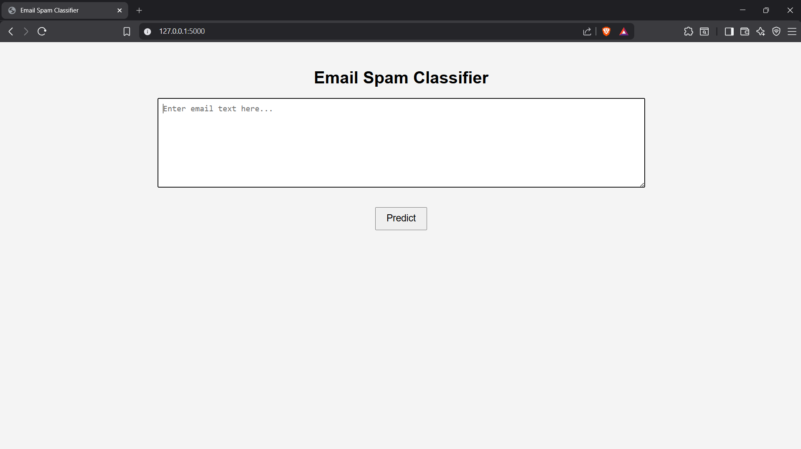
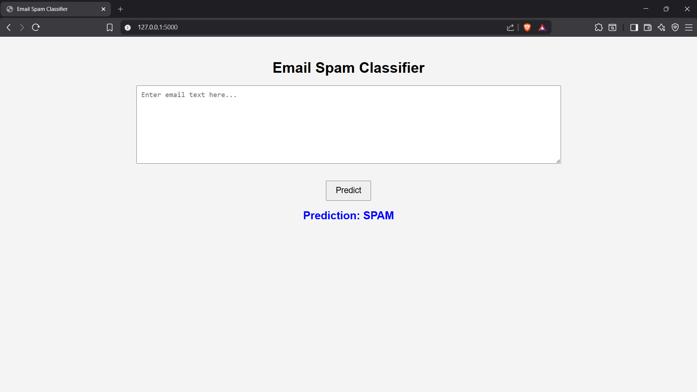
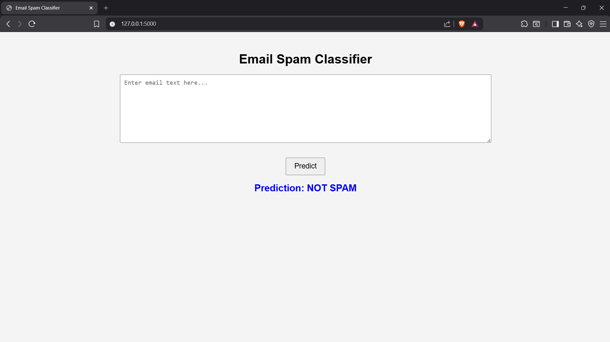
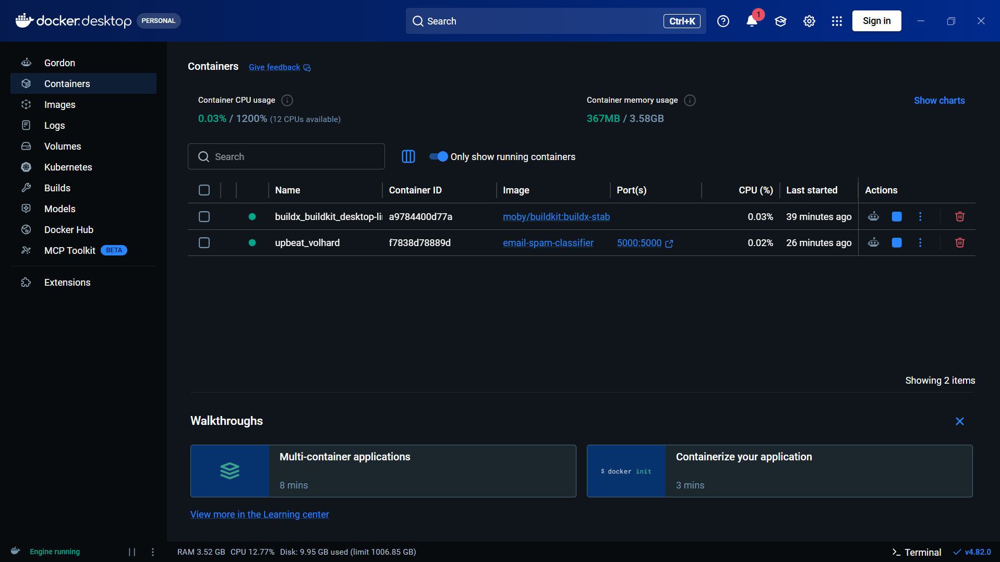
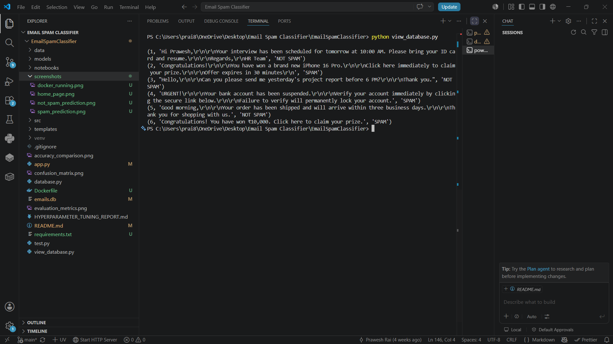

# 📧 Email Spam Classifier

An end-to-end Machine Learning project that classifies emails as **Spam** or **Not Spam** using Natural Language Processing (NLP), TF-IDF Vectorization, and Logistic Regression. The project features a Flask web application, SQLite database integration, Docker containerization, and hyperparameter tuning for improved model performance.

---

## 🚀 Features

- Email Spam Detection using Machine Learning
- Text Preprocessing and Cleaning
- TF-IDF Feature Extraction
- Logistic Regression Classifier
- Hyperparameter Tuning using GridSearchCV
- Model Performance Comparison
- Flask Web Application
- SQLite Database Integration
- Docker Containerization
- Confusion Matrix and Evaluation Metrics
- Accuracy Comparison Visualization

---

## 🛠️ Technologies Used

- Python
- Flask
- Scikit-learn
- Pandas
- NumPy
- SQLite
- HTML
- CSS
- Docker
- Pickle

---

## 📂 Project Structure

```text
EmailSpamClassifier/
│
├── data/
├── models/
│   ├── spam_model.pkl
│   ├── spam_model_tuned.pkl
│   └── vectorizer.pkl
│
├── notebooks/
│
├── screenshots/
│   ├── home_page.png
│   ├── spam_prediction.png
│   ├── not_spam_prediction.png
│   ├── docker_running.png
│   └── database_output.png
│
├── src/
│   ├── preprocess.py
│   ├── feature_extraction.py
│   ├── model_training.py
│   ├── hyperparameter_tuning.py
│   ├── model_comparison.py
│   ├── evaluation.py
│   ├── visualization.py
│   └── spam_classifier.py
│
├── templates/
│   └── index.html
│
├── app.py
├── database.py
├── view_database.py
├── Dockerfile
├── requirements.txt
├── emails.db
├── README.md
└── .gitignore
```

---

## ⚙️ Installation

### 1. Clone the Repository

```bash
git clone https://github.com/Prawesh-Rai/email-spam-classifier-
```

### 2. Navigate to the Project Folder

```bash
cd EmailSpamClassifier
```

### 3. Install Dependencies

```bash
pip install -r requirements.txt
```

### 4. Run the Application

```bash
python app.py
```

### 5. Open in Browser

```
http://127.0.0.1:5000
```

---

## 🐳 Docker

### Build Docker Image

```bash
docker build -t email-spam-classifier .
```

### Run Docker Container

```bash
docker run --rm -p 5000:5000 email-spam-classifier
```

### Access the Application

```
http://localhost:5000
```

---

## 📊 Model Performance

The project uses:

- TF-IDF Vectorization
- Logistic Regression Classifier
- Hyperparameter Tuning (GridSearchCV)
- Accuracy Evaluation
- Confusion Matrix
- Model Comparison
- Precision, Recall and F1-Score

---

## 📸 Project Screenshots

### 🏠 Home Page



---

### 🚫 Spam Prediction



---

### ✅ Not Spam Prediction



---

### 🐳 Docker Container Running



---

### 🗄️ SQLite Database Output



---

## 🔮 Future Improvements

- Deep Learning based Spam Detection
- Email Attachment Analysis
- User Authentication
- REST API Integration
- Deployment on Render or Railway
- Cloud Database Integration
- Email Inbox Integration
- Improved UI Design

---

## 👨‍💻 Author

**Prawesh Kumar Rai**

B.Tech Computer Science Engineering (Artificial Intelligence & Data Science)

Apeejay Stya University

GitHub: https://github.com/Prawesh-Rai

---

## ⭐ If you found this project useful, consider giving it a star on GitHub!